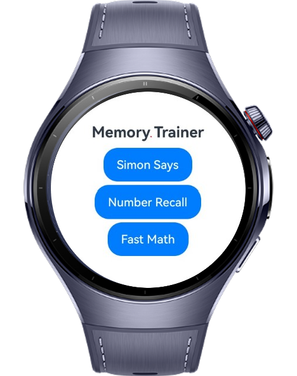
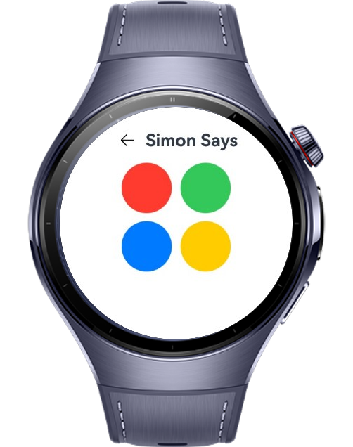
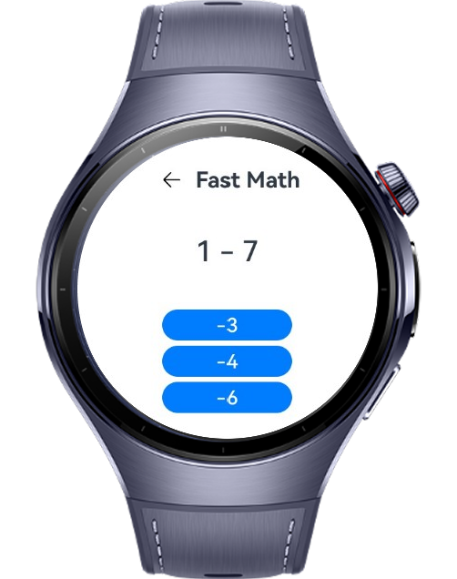

> **Note:** To access all shared projects, get information about environment setup, and view other guides, please visit [Explore-In-HMOS-Wearable Index](https://github.com/Explore-In-HMOS-Wearable/hmos-index).

# MemoryTrainer

**MemoryTrainer** is a smartwatch application developed with HarmonyOS ArkTS/ArkUI. It features a collection of mini memory games designed to train your brain using short, interactive sessions on wearable devices. The interface is simple, clean, and optimized for small screens.

# Preview

<div>    
  
  
  
  
</div> 

# Use Cases

- **Game Menu**: Access all available mini-games from the home screen.
- **Simon Says**: Repeat the correct color pattern in order.
- **Number Recall**: Memorize and input a number sequence shown briefly.
- **Fast Math**: Solve quick arithmetic problems under time pressure.

# Tech Stack

- **Languages**: ArkTS
- **Frameworks**: HarmonyOS SDK 5.1.0(18)
- **Tools**: DevEco Studio Vers 5.1.0.842

# Directory Structure

```
entry/src/main/ets/
|---entryability
|---|---EntryAbility
|---entrybackupability
|---|---EntryBackupAbility
|---model
|---|---GameItem
|---|---SimonColor
|---pages
|---|---FastMathPage
|---|---Index
|---|---NumberRecallPage
|---|---SimonSaysPage
|---util
|---|---NavigationUtil
|---viewmodel
|---|---FastMathViewModel
|---|---NumberRecallViewModel
|---|---SimonSaysViewModel
```

# Constraints and Restrictions

## Supported Devices
- Huawei Watch 5

# LICENSE

MemoryTrainer is distributed under the terms of the MIT License.
See the [LICENSE](/LICENSE) for more information.
